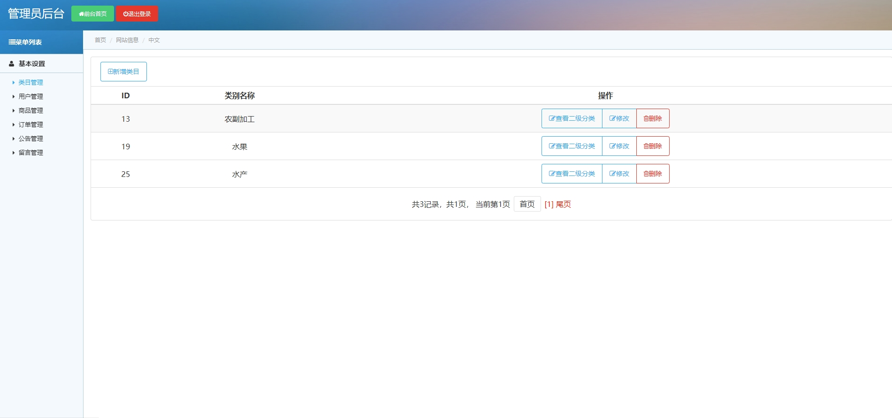
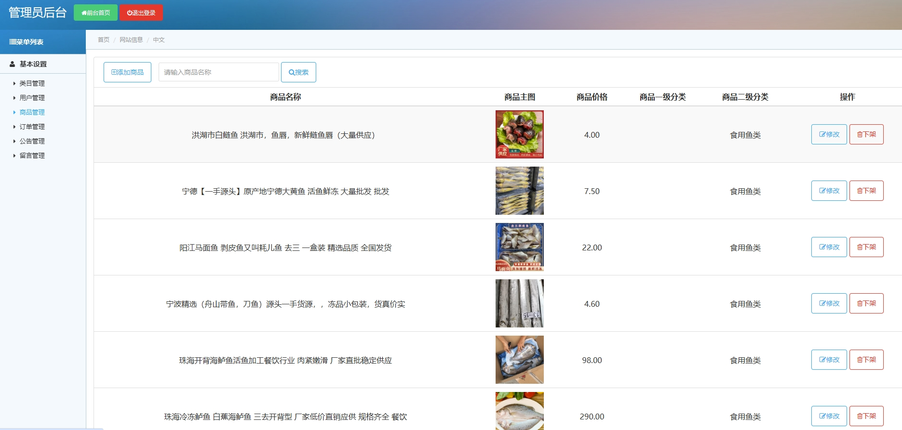
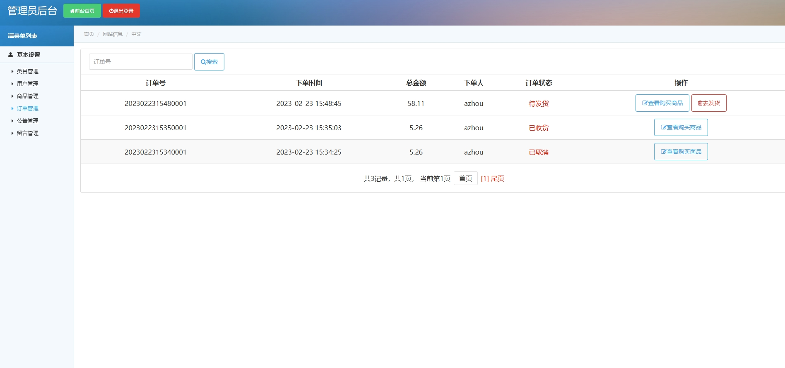
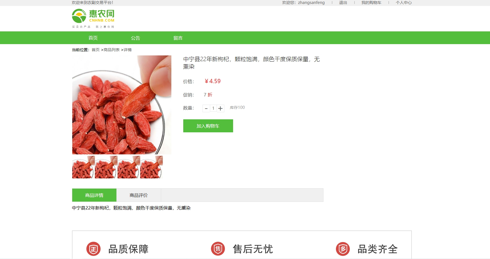
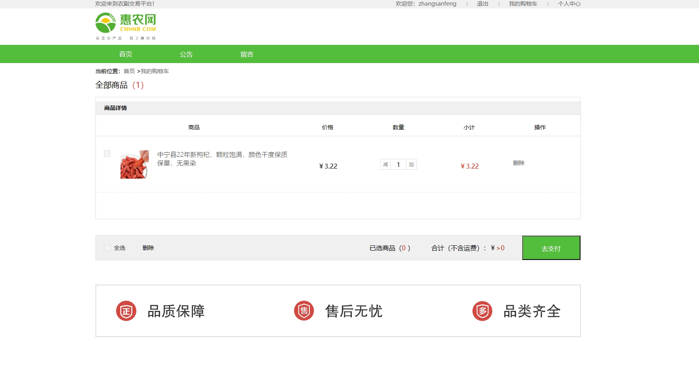
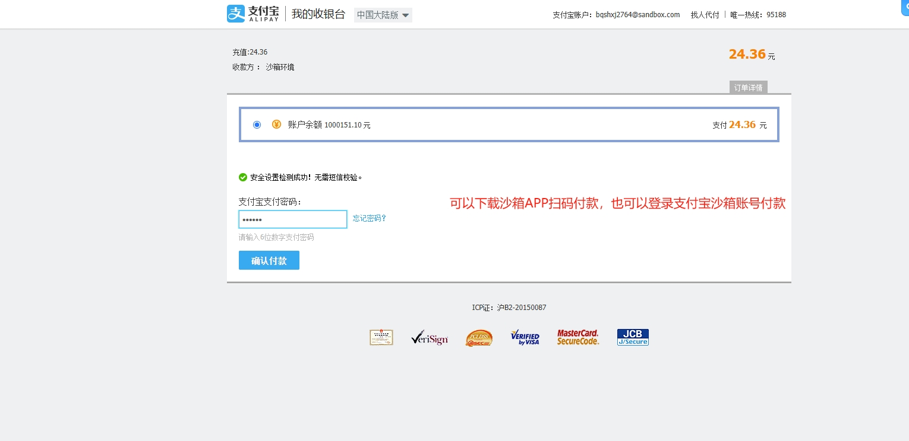
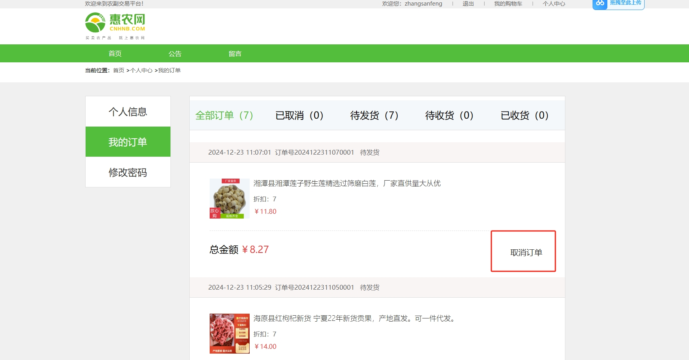
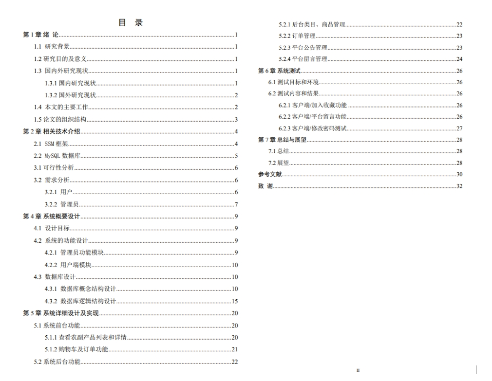

# 1.项目介绍
- 系统功能模块:管理员（类目管理、用户管理、商品管理、订单管理、公告管理）、普通用户（购物车、下单、个人中心等）
- 技术选型：SSM、jsp
- 测试环境：idea2024，mysql5.7，maven3，jdk8，tomcat8.5
# 2.项目部署
- 创建数据库，并导入sql文件
- 通过idea打开项目farm_products_shop，根据本地数据库环境配置：src/db.properties 1-4行
- 支付使用的是支付宝沙箱，配置方法可以去小程序里搜索“动物公益”，去商品详情里查看配置。需要注意的是，natapp内网穿透隧道配置将端口改为8080，支付宝开放平台里需要将授权回调地址改为：http://替换为natapp隧道启动后生成的域名/farm/order/notifyPayResult
- 配置tomcat并启动，其中tomcat配置中deployment下的applciation contex配置为：/farm
- 管理web：http://localhost:8080/farm/login/toLogin，账号密码：admin、123456
- 前端门户：http://localhost:8080/farm， 账号密码可以注册或者查看表
# 3.项目部分截图

# 4.获取方式
[戳我查看](https://gitee.com/aven999/mall)
